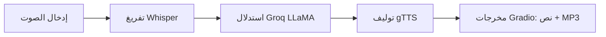

[English](../README.md) · [العربية](README.ar.md) · [Español](README.es.md) · [Français](README.fr.md) · [日本語](README.ja.md) · [한국어](README.ko.md) · [Tiếng Việt](README.vi.md) · [中文 (简体)](README.zh-Hans.md) · [中文（繁體）](README.zh-Hant.md) · [Deutsch](README.de.md) · [Русский](README.ru.md)


[](https://github.com/lachlanchen/lachlanchen/blob/main/figs/banner.png)

# روبوت الدردشة الصوتية باستخدام Whisper وLLaMA وGroq API


هذا المستودع يقدّم روبوت دردشة صوتية بسيطًا ومركزًا في ملف واحد. فهو يلتقط الكلام، ويحوله إلى نص باستخدام Whisper، ويرسل النص إلى LLaMA المستضاف على Groq للمعالجة والاستنتاج، ثم يحول الردّ النصي إلى كلام عبر Google Text-to-Speech (gTTS). التفاعل مع المستخدم النهائي يتم عبر Gradio مع مخرجات نصية وصوتية.

> **الهدف:** إنشاء مسار عملي وقابل للإعادة، يمكن تشغيله محليًا أو داخل Colab عبر سكربت رئيسي واحد.

## 🧭 لمحة سريعة

| المجال | الحالة |
|---|---|
| نطاق اللغة | `README.md` مع نسخ مترجمة في `i18n/` |
| مرجع الحقيقة الأساسية | ملف README الإنجليزي في الجذر هو مرجع المحاذاة |
| نمط التشغيل الموصى به | `Local` أولاً، `Colab` ثانياً |

## 🔎 تفاصيل اللمحة السريعة

| التركيز | الحالة |
|---|---|
| نقطة الدخول | `voice_to_voice_chatbot.py` |
| الواجهة | واجهة ويب تعتمد على Gradio بنص + صوت |
| نموذج STT | Whisper (`base`) |
| محرك LLM | Groq-hosted `llama3-8b-8192` |
| محرك TTS | Google Text-to-Speech |
| توثيق اللغة | 10+ ملفات README مترجمة داخل `i18n/` |

## نظرة عامة

يطبق التطبيق أنبوبًا متكاملاً للمحادثة داخل `voice_to_voice_chatbot.py`:

1. استقبال الصوت الصوتي للمستخدم من الميكروفون أو ملف مرفوع.
2. تفريغ الكلام إلى نص عبر نموذج Whisper (`base`).
3. توليد رد باستخدام Groq و`llama3-8b-8192`.
4. تحويل النص المولد إلى MP3 عبر gTTS.
5. عرض النص وتَحكّمات التشغيل داخل Gradio.

### خط أنابيب المحادثة

| المرحلة | المكوّن | الإخراج |
|---|---|---|
| 🎙️ الإدخال | `gr.Audio(type="filepath")` | مسار ملف صوتي |
| 📝 التفريغ النصي | نموذج Whisper `base` | نص النص التفريغي |
| 🧠 الاستدلال | استجابة دردشة Groq | نص رد المساعد |
| 🔊 التوليف | `gTTS` | مسار MP3 للرد |
| 🖥️ التسليم | Gradio `Interface` | نص الرد + تشغيل الصوت |



## ⭐ الميزات

- **STT + LLM + TTS في سكربت واحد**: حلقة صوتية كاملة في `voice_to_voice_chatbot.py`.
- **يدعم الميكروفون ورفع الملفات**: اختيار التحدث المباشر أو رفع تسجيل صوتي.
- **إعداد خفيف**: مجموعة صغيرة فقط من حزم Python.
- **توثيق متعدد اللغات**: تُحفظ نسخ README المترجمة داخل `i18n/`.
- **رؤية واضحة للتصحيح**: أخطاء الدوال تظهر في الواجهة لسرعة تتبّع المشكلات.

## 📁 هيكل المشروع

```text
Voice-to-text-and-voice-chatbot/
    ├── requirements.txt              # Python dependencies
    ├── voice_to_voice_chatbot.py     # Main application script
    ├── i18n/                        # Translated README files
│   ├── README.ar.md
│   ├── README.de.md
│   ├── README.es.md
│   ├── README.fr.md
│   ├── README.ja.md
│   ├── README.ko.md
│   ├── README.ru.md
│   ├── README.vi.md
│   ├── README.zh-Hans.md
│   └── README.zh-Hant.md
└── .auto-readme-work/            # Metadata produced for README generation
    ├── 20260228_230442/
    ├── 20260301_064403/
    └── 20260301_065134/
        ├── language-nav-i18n.md
        ├── language-nav-root.md
        ├── pipeline-context.md
        └── translation-plan.txt
```

## 🌍 التوطين والتوثيق

يعتمد هذا المشروع README واحدًا موثوقًا به باللغة الإنجليزية ويقدّم نسخًا مترجمة داخل `i18n/`.

- استخدم روابط اللغات قرب بداية الملف للتبديل بين نسخ README المترجمة.
- تغطي الترجمات الحالية 10+ لغات وينبغي إبقاؤها متزامنة مع بنية النسخة الإنجليزية.
- يفضّل تحديث English README أولًا، ثم موائمة الملفات المترجمة مع التغييرات البنيوية والأوامر الرئيسية.

## ✅ المتطلبات المسبقة

- Python 3.7+ runtime.
- مفتاح API صالح من Groq.
- اتصال بالإنترنت لتحميل نموذج Whisper وطلبات الـ API.
- اختيارية: إذونات الميكروفون في المتصفح إذا كنت تستخدم الصوت المباشر.
- اختيارية: وجود GPU قد يحسّن زمن الاستجابة وثبات تفريغ الصوت في Whisper.

### المتطلبات بإيجاز

| المتطلب | سبب الاحتياج |
|---|---|
| Python `3.7+` | بيئة تشغيل Gradio وWhisper والتبعيات |
| مفتاح Groq API | مطلوب لاستدعاء استنتاج LLM |
| `requirements.txt` | يثبت جميع حزم Python المطلوبة |
| إذن الميكروفون بالمتصفح | يفعّل إدخال الصوت عبر Gradio |

## 🛠️ التثبيت

1. استنساخ المستودع:

```bash
git clone <repo-url>
cd Voice-to-text-and-voice-chatbot
```

2. تثبيت التبعيات:

```bash
pip install -r requirements.txt
```

في Google Colab:

```python
!pip install -U gradio openai-whisper gtts groq
```

### ملاحظات

- يحتوي requirements حالياً على `whisper` و `openai-whisper` معًا.
- إذا واجهت تعارضات في الحزم، ففضّل النسخة التي تتوافق مع بيئتك واحذف التثبيتات المكررة بعد التحقق.

## 🧯 قائمة جاهزية التشغيل

| الخطوة | الفحص |
|---|---|
| مفتاح API | إعداد `GROQ_API_KEY` أو بديل موثوق محليًا بشكل صحيح |
| جهاز الصوت | إذن ميكروفون المتصفح مفعّل للإدخال المباشر |
| مسار التشغيل | تنفذ الأوامر من جذر المشروع مع التبعيات المثبتة |
| مسار الإخراج | المجلدات المؤقتة قابلة للكتابة لملفات MP3 |

## ⚙️ التكوين

### متغير البيئة (موصى به)

```bash
export GROQ_API_KEY='your_groq_api_key'
```

في بيئة Colab:

```python
import os
os.environ['GROQ_API_KEY'] = 'your_groq_api_key'
```

### ملاحظة تشغيل مهمة (السلوك الحالي)

يبدأ `voice_to_voice_chatbot.py` حاليًا Groq بهذا الشكل:

```python
client = Groq(
    api_key="your_groq_api_key",
)
```

إذا كنت تُعد المتغير فقط عبر `GROQ_API_KEY`، حدّث السكربت لقراءة المفتاح من `os.getenv` أو ثبّت قيمة موثوقة محليًا قبل التشغيل:

```python
client = Groq(api_key=os.getenv("GROQ_API_KEY", "your_groq_api_key"))
```

### الافتراضات

- من المتوقع تشغيل هذا المستودع في بيئة Python محلية أو Colab.
- لا يوجد نقطة دخول منفصلة للخادم أو إعدادات نشر في هذه النسخة.

## ▶️ طريقة الاستخدام

ابدأ التطبيق عبر:

```bash
python voice_to_voice_chatbot.py
```

سيُطلق Gradio واجهة محلية فيها إدخال صوتي واحد ومخرجان:

- `Response Text`
- `Response Audio`

### التفاعل مع الروبوت

- **المايكروفون**: اضغط تسجيل وتحدث؛ يتم تفريغ الصوت ثم الرد وتشغيله.
- **رفع ملف**: اختر ملفًا صوتيًا ليُفّرغ ويُستخدم لتوليد الرد.

## 🎬 أمثلة

### مثال على التدفق

1. اسأل: "What are three tips to learn Python quickly?"
2. يسترجع Whisper النص.
3. يولد Groq الرد.
4. يصيغ gTTS المخرجات.
5. تعرض الواجهة النص والرد الصوتي.

### النتيجة المتوقعة

- يظهر تفريغ صحيح في مربع نص الرد.
- ملف صوتي غير فارغ في مشغل Gradio.

## 🧪 ملاحظات التطوير

- الدالة الأساسية: `chatbot_pipeline(audio_path)`.
- يتم تحميل Whisper مرة واحدة عند استيراد الوحدة باستخدام `whisper.load_model("base")`.
- يستخدم مخرج الصوت `NamedTemporaryFile(..., delete=False)` لاستمرار ملفات mp3.
- في حالة الخطأ، يتم إرجاع `(str(e), None)` للحفاظ على استجابة واجهة سريعة.
- يتم استدعاء `iface.launch()` عند استيراد الوحدة؛ لاستخدامه كمكتبة، ضع كود الإطلاق داخل `if __name__ == "__main__":`.

## 🐞 استكشاف الأخطاء وإصلاحها

### المشكلات الشائعة

- `ModuleNotFoundError` لـ Whisper:

```bash
pip install -U openai-whisper
```

- فشل مصادقة Groq:
  - تأكد من استبدال المفتاح الوهمي بمفتاح فعلي أو تحميله من البيئة.
  - تأكد أن للمفتاح صلاحيات وحصص كافية.

- عدم وجود مخرجات صوتية:
  - تأكد من اتصال الإنترنت لخدمات Groq وgTTS.
  - تأكد أن مسار MP3 المؤقت قابل للكتابة في البيئة.

### قائمة فحص تشخيص سريعة

| الفحص | التحقق |
|---|---|
| مصدر مفتاح API | `Groq(api_key=...)` هو مفتاح صالح |
| التبعية الخاصة بـ STT | نجاح `import whisper` و `openai-whisper` |
| مسار الصوت | Gradio يستقبل مسار ملف صوتي صالح |
| عرض المخرجات | الواجهة ترجع نصًا وملفًا صوتيًا |

## 🗺️ خارطة الطريق

- استبدال المفتاح المضمن داخل الكود بتكوين قائم على البيئة بشكل افتراضي.
- إضافة اختيار نموذج يعتمد على البيئة (`whisper` size، Groq model ID).
- إضافة اختبارات أدنى لوظائف المساعدة.
- إضافة أوامر واجهة سطرية وإعدادات نشر (Docker / Hugging Face Spaces).

## ♻️ استراتيجية الصيانة والمزامنة

للحفاظ على جودة README متعدد اللغات:

1. حدّث `README.md` الإنجليزي أولاً في حال تغيّرت البنية أو التفاصيل التقنية.
2. انسخ العناوين والتعديلات الجوهرية إلى ترجمات `i18n/`.
3. أبقِ عناصر البانر وقطع الدعم متوافقة عبر كل نسخة محلية.

## 🤝 المساهمة

المساهمات مرحّبة. المقترح التالي:

1. افتح fork للمستودع.
2. أنشئ فرع ميزة (feature branch).
3. نفّذ تغييراتك.
4. افتح pull request واضحًا مع السبب وملاحظات الاختبار.

## 📄 الترخيص

يشير هذا المستودع إلى نية الترخيص بنظام MIT، لكن لا يوجد ملف `LICENSE` في هذه النسخة. يرجى إضافة ملف ترخيص إذا كان التوزيع يتطلب ذلك.


## ❤️ Support

| Donate | PayPal | Stripe |
| --- | --- | --- |
| [](https://chat.lazying.art/donate) | [](https://paypal.me/RongzhouChen) | [](https://buy.stripe.com/aFadR8gIaflgfQV6T4fw400) |
