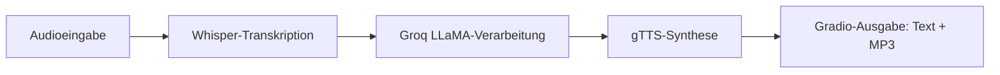

[English](../README.md) · [العربية](README.ar.md) · [Español](README.es.md) · [Français](README.fr.md) · [日本語](README.ja.md) · [한국어](README.ko.md) · [Tiếng Việt](README.vi.md) · [中文 (简体)](README.zh-Hans.md) · [中文（繁體）](README.zh-Hant.md) · [Deutsch](README.de.md) · [Русский](README.ru.md)


[](https://github.com/lachlanchen/lachlanchen/blob/main/figs/banner.png)

# Voice-to-Voice Chatbot mit Whisper, LLaMA und Groq API


Dieses Repository stellt einen kompakten Voice-to-Voice-Chatbot in einer einzelnen Datei bereit. Es nimmt Sprache auf, transkribiert sie mit Whisper, sendet den Text an Groq-gehostetes LLaMA für die Verarbeitung und erzeugt eine gesprochene Antwort mit Google Text-to-Speech (gTTS). Die Nutzerinteraktion läuft über Gradio mit Text- und Audioausgaben.

> **Ziel:** Eine praktische, reproduzierbare Pipeline, die du lokal oder in Colab mit einem einzelnen Hauptskript ausführen kannst.

## 🧭 Schnellübersicht

| Bereich | Status |
|---|---|
| Sprachumfang | `README.md` plus mehrsprachige Kopien in `i18n/` |
| Single Source of Truth | Englisches Root-README steuert den Lokalisierungsabgleich |
| Empfohlener Ausführungsmodus | `Local` zuerst, `Colab` danach |

## 🔎 Details zur Schnellübersicht

| Fokus | Status |
|---|---|
| Einstiegspunkt | `voice_to_voice_chatbot.py` |
| Oberfläche | Gradio-basierte Web-UI mit Text + Audio |
| STT-Modell | Whisper (`base`) |
| LLM-Backend | Groq-gehostetes `llama3-8b-8192` |
| TTS-Engine | Google Text-to-Speech |
| Sprachdokumentation | 10+ übersetzte README-Dateien in `i18n/` |

## Überblick

Die App implementiert eine vollständige Konversationspipeline in `voice_to_voice_chatbot.py`:

1. Nutzer*innen-Audio wird über Mikrofon oder Datei-Upload empfangen.
2. Sprache wird mit dem Whisper (`base`)-Modell transkribiert.
3. Groq + `llama3-8b-8192` erzeugen eine Antwort.
4. Der Text wird mit gTTS in eine MP3-Datei umgewandelt.
5. Die Textantwort und Wiedergabesteuerung werden in Gradio dargestellt.

### Konversations-Pipeline

| Stufe | Komponente | Ausgabe |
|---|---|---|
| 🎙️ Eingabe | `gr.Audio(type="filepath")` | Audio-Dateipfad |
| 📝 Transkription | Whisper `base`-Modell | Transkript-Text |
| 🧠 Verarbeitung | Groq Chat Completion | Assistententext |
| 🔊 Synthese | `gTTS` | MP3-Antwort-Pfad |
| 🖥️ Bereitstellung | Gradio `Interface` | Antworttext + Audio-Wiedergabe |



## ⭐ Features

- **STT + LLM + TTS in einem Skript**: voller Sprach-Loop in `voice_to_voice_chatbot.py`.
- **Mikrofon- und Dateiunterstützung**: Direkte Spracheingabe oder Upload bereits aufgezeichneter Dateien.
- **Leichtgewichtiges Setup**: nur ein kleiner Satz an Python-Paketen.
- **Mehrsprachige Dokumentation**: Lokalisierte READMEs werden in `i18n/` gepflegt.
- **Praktische Fehlersichtbarkeit**: Fehlertexte auf Funktionsniveau erscheinen in der UI und beschleunigen die Iteration.

## 📁 Projektstruktur

```text
Voice-to-text-and-voice-chatbot/
    ├── requirements.txt              # Python-Abhängigkeiten
    ├── voice_to_voice_chatbot.py     # Hauptanwendungsskript
    ├── i18n/                        # Übersetzte README-Dateien
│   ├── README.ar.md
│   ├── README.de.md
│   ├── README.es.md
│   ├── README.fr.md
│   ├── README.ja.md
│   ├── README.ko.md
│   ├── README.ru.md
│   ├── README.vi.md
│   ├── README.zh-Hans.md
│   └── README.zh-Hant.md
└── .auto-readme-work/            # Metadaten für die README-Generierung
    ├── 20260228_230442/
    ├── 20260301_064403/
    └── 20260301_065134/
        ├── language-nav-i18n.md
        ├── language-nav-root.md
        ├── pipeline-context.md
        └── translation-plan.txt
```

## 🌍 Lokalisierung und Dokumentation

Dieses README-Projekt hält ein einziges Quell-README in Englisch als Referenz und stellt Übersetzungen in `i18n/` bereit.

- Nutze die Sprachlinks im oberen Bereich dieser Datei, um zwischen den README-Versionen zu wechseln.
- Bestehende Übersetzungen decken über 10 Sprachen ab und sollten in Struktur und Inhalt mit dem englischen Original synchron bleiben.
- Bevorzuge eine Aktualisierung des englischen READMEs zuerst, anschließend die Übersetzungen strukturell angleichen.

## ✅ Voraussetzungen

- Python 3.7+ Runtime.
- Ein gültiger Groq API-Schlüssel.
- Internetzugang für den Download des Whisper-Modells und API-Aufrufe.
- Optional: Mikrofonberechtigung im Browser bei Nutzung der Live-Audio-Funktion.
- Optional: Eine GPU kann Latenz und Konsistenz der Whisper-Transkription verbessern.

### Anforderungen auf einen Blick

| Anforderung | Warum sie nötig ist |
|---|---|
| Python `3.7+` | Laufzeit für Gradio, Whisper und weitere Abhängigkeiten |
| Groq API-Key | Benötigt für Aufrufe der LLM-Inferenz |
| `requirements.txt` | Installiert alle benötigten Python-Pakete |
| Browser-Mikrofonzugriff | Ermöglicht Spracheingabe über Gradio |

## 🛠️ Installation

1. Repository klonen:

```bash
git clone <repo-url>
cd Voice-to-text-and-voice-chatbot
```

2. Abhängigkeiten installieren:

```bash
pip install -r requirements.txt
```

Für Google Colab verwende:

```python
!pip install -U gradio openai-whisper gtts groq
```

### Hinweise

- Das Repository enthält aktuell sowohl `whisper` als auch `openai-whisper` in den Abhängigkeiten.
- Bei Paketkonflikten verwende bevorzugt die Variante passend zu deiner Umgebung und entferne redundante Installationen nach Validierung.

## 🧯 Laufbereitschafts-Checkliste

| Schritt | Prüfung |
|---|---|
| API-Schlüssel | `GROQ_API_KEY` oder vertrauenswürdiger lokaler Fallback ist korrekt konfiguriert |
| Audiogerät | Browser-Mikrofon ist für Live-Eingabe aktiviert |
| Laufzeitpfad | Befehle laufen aus dem Projekt-Root bei installierten Abhängigkeiten |
| Ausgabepfad | Temporäre Verzeichnisse sind beschreibbar für MP3-Antworten |

## ⚙️ Konfiguration

### Umgebungsvariable (empfohlen)

```bash
export GROQ_API_KEY='your_groq_api_key'
```

In der Colab-Runtime:

```python
import os
os.environ['GROQ_API_KEY'] = 'your_groq_api_key'
```

### Wichtiger Laufzeit-Hinweis (aktuelles Verhalten)

`voice_to_voice_chatbot.py` initialisiert Groq derzeit so:

```python
client = Groq(
    api_key="your_groq_api_key",
)
```

Wenn du nur `GROQ_API_KEY` setzt, aktualisiere das Skript auf `os.getenv` oder hinterlege einen vertrauenswürdigen lokalen Umgebungswert hartkodiert vor dem Start:

```python
client = Groq(api_key=os.getenv("GROQ_API_KEY", "your_groq_api_key"))
```

### Annahmen

- Dieses Repository ist für den Betrieb in einer lokalen Python-Umgebung oder Colab gedacht.
- Es ist kein separates Server-Entrypoint oder Bereitstellungs-Setup in diesem Snapshot enthalten.

## ▶️ Verwendung

Starte die Anwendung mit:

```bash
python voice_to_voice_chatbot.py
```

Gradio startet eine lokale Oberfläche mit einem Audioeingang und zwei Ausgaben:

- `Response Text`
- `Response Audio`

### Interaktion mit dem Chatbot

- **Mikrofon**: Aufzeichnen klicken und sprechen; das Audio wird transkribiert, beantwortet und wiedergegeben.
- **Datei hochladen**: Eine Audiodatei auswählen, die transkribiert und als Basis für die Antwort genutzt wird.

## 🎬 Beispiele

### Beispielablauf

1. Frage: "What are three tips to learn Python quickly?"
2. Whisper liefert ein Transkript.
3. Groq erstellt eine Antwort.
4. gTTS synthetisiert die Ausgabe.
5. UI zeigt Text und Audio-Antwort an.

### Erwartete Ausgabe

- Erfolgreiche Transkription im Antwort-Textfeld.
- Nicht leere gesprochene Antwortdatei im Gradio-Audioplayer.

## 🧪 Entwicklungsnotizen

- Kernfunktion: `chatbot_pipeline(audio_path)`.
- Whisper wird einmalig beim Modulimport mit `whisper.load_model("base")` geladen.
- Audioausgabe nutzt `NamedTemporaryFile(..., delete=False)` für MP3-Persistenz.
- Fehlerpfad gibt `(str(e), None)` zurück, um die UI bei Fehlern responsiv zu halten.
- `iface.launch()` wird beim Modulimport aufgerufen; für nutzbare Bibliotheksintegration sollte Startcode mit `if __name__ == "__main__":` geschützt werden.

## 🐞 Fehlerbehebung

### Häufige Probleme

- `ModuleNotFoundError` für Whisper:

```bash
pip install -U openai-whisper
```

- Groq-Authentifizierungsfehler:
  - Stelle sicher, dass der Platzhalter-API-Schlüssel ersetzt oder aus den Umgebungsvariablen geladen ist.
  - Prüfe, ob der Schlüssel ausreichende Berechtigungen und Kontingente hat.

- Keine Audioausgabe:
  - Prüfe ausgehende Konnektivität für Groq und gTTS.
  - Stelle sicher, dass der temporäre MP3-Pfad in der Umgebung beschreibbar ist.

### Kurze Fehlerdiagnose-Checkliste

| Prüfung | Validierung |
|---|---|
| API-Schlüsselquelle | `Groq(api_key=...)` ist ein gültiger Schlüssel |
| STT-Abhängigkeit | `import whisper` und `openai-whisper`-Import funktionieren |
| Audio-Pfad | Gradio erhält einen gültigen Audio-Dateipfad |
| Ausgabe-Rendern | UI gibt sowohl Antworttext als auch Audio aus |

## 🗺️ Roadmap

- Harte Codierung des Groq-Schlüssels durch standardmäßige env-basierte Konfiguration ersetzen.
- Modellauswahl per Umgebung (Whisper-Größe, Groq-Modell-ID) ergänzen.
- Minimale Tests für Hilfsfunktionen hinzufügen.
- CLI- und Deployment-Vorlagen ergänzen (Docker/Hugging Face Spaces).

## ♻️ Wartungs- und Sync-Strategie

Zur Sicherstellung konsistenter Qualität multilinguale READMEs:

1. Aktualisiere zuerst das englische `README.md` bei strukturellen oder technischen Änderungen.
2. Übernehme Überschriften und Schlüsselinhalte strukturell in die Übersetzungen unter `i18n/`.
3. Halte Banner- und Support-Block in allen lokalen Versionen konsistent.

## 🤝 Mitwirken

Beiträge sind willkommen. Empfohlener Ablauf:

1. Repository forken.
2. Einen Feature-Branch erstellen.
3. Änderungen implementieren.
4. Einen klaren Pull Request mit Begründung und Testnotizen eröffnen.

## 📄 Lizenz

Dieses Repository verweist auf eine beabsichtigte MIT-Lizenz, aber es ist keine `LICENSE`-Datei in diesem Snapshot vorhanden. Bitte füge eine Lizenzdatei hinzu, falls eine Verteilung unter Lizenz erforderlich ist.


## ❤️ Support

| Donate | PayPal | Stripe |
| --- | --- | --- |
| [](https://chat.lazying.art/donate) | [](https://paypal.me/RongzhouChen) | [](https://buy.stripe.com/aFadR8gIaflgfQV6T4fw400) |
