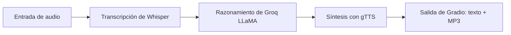

[English](../README.md) · [العربية](README.ar.md) · [Español](README.es.md) · [Français](README.fr.md) · [日本語](README.ja.md) · [한국어](README.ko.md) · [Tiếng Việt](README.vi.md) · [中文 (简体)](README.zh-Hans.md) · [中文（繁體）](README.zh-Hant.md) · [Deutsch](README.de.md) · [Русский](README.ru.md)


[](https://github.com/lachlanchen/lachlanchen/blob/main/figs/banner.png)

# Chatbot de voz a voz con Whisper, LLaMA y la API de Groq


Este repositorio ofrece un chatbot de voz compacto de un solo archivo. Captura voz, la transcribe con Whisper, envía el texto a LLaMA alojado en Groq para razonar y sintetiza la respuesta hablada mediante Google Text-to-Speech (gTTS). La interacción final del usuario la gestiona Gradio con salidas de texto y audio.

> **Objetivo:** un flujo práctico y reproducible que puedes ejecutar localmente o en Colab con un único script principal.

## 🧭 Resumen rápido

| Área | Estado |
|---|---|
| Alcance del idioma | `README.md` más copias multilingües en `i18n/` |
| Fuente de verdad | README en inglés en la raíz impulsa la sincronización de localización |
| Modo de ejecución recomendado | `Local` primero, `Colab` después |

## 🔎 Detalles del resumen rápido

| Enfoque | Estado |
|---|---|
| Punto de entrada | `voice_to_voice_chatbot.py` |
| Interfaz | Interfaz web basada en Gradio con texto + audio |
| Modelo STT | Whisper (`base`) |
| Motor LLM | Groq-hosted `llama3-8b-8192` |
| Motor TTS | Google Text-to-Speech |
| Documentación de idiomas | 10+ archivos README traducidos en `i18n/` |

## Visión general

La aplicación implementa una tubería de conversación de extremo a extremo en `voice_to_voice_chatbot.py`:

1. Recibe audio del usuario desde entrada de micrófono o carga de archivo.
2. Transcribe la voz a texto con el modelo Whisper (`base`).
3. Genera una respuesta mediante Groq y `llama3-8b-8192`.
4. Convierte el texto generado en MP3 con gTTS.
5. Muestra el texto de respuesta y controles de reproducción en Gradio.

### Flujo de conversación

| Etapa | Componente | Salida |
|---|---|---|
| 🎙️ Entrada | `gr.Audio(type="filepath")` | Ruta del archivo de audio |
| 📝 Transcripción | Modelo `base` de Whisper | Texto de transcripción |
| 🧠 Razonamiento | Chat completion de Groq | Texto de respuesta del asistente |
| 🔊 Síntesis | `gTTS` | Ruta de MP3 de respuesta |
| 🖥️ Entrega | `Gradio` `Interface` | Texto de respuesta + reproducción de audio |



## ⭐ Características

- **STT + LLM + TTS en un solo script**: bucle de voz completo en `voice_to_voice_chatbot.py`.
- **Soporte de micrófono y archivo**: selecciona voz en vivo o sube archivos grabados.
- **Configuración ligera**: solo un conjunto pequeño de paquetes de Python.
- **Documentación multilingüe**: los README localizados se mantienen en `i18n/`.
- **Depuración práctica**: los errores a nivel de función se muestran en la interfaz para iteración rápida.

## 📁 Estructura del proyecto

```text
Voice-to-text-and-voice-chatbot/
    ├── requirements.txt              # Dependencias de Python
    ├── voice_to_voice_chatbot.py     # Script principal de la aplicación
    ├── i18n/                        # Archivos README traducidos
│   ├── README.ar.md
│   ├── README.de.md
│   ├── README.es.md
│   ├── README.fr.md
│   ├── README.ja.md
│   ├── README.ko.md
│   ├── README.ru.md
│   ├── README.vi.md
│   ├── README.zh-Hans.md
│   └── README.zh-Hant.md
└── .auto-readme-work/            # Metadatos generados para la generación del README
    ├── 20260228_230442/
    ├── 20260301_064403/
    └── 20260301_065134/
        ├── language-nav-i18n.md
        ├── language-nav-root.md
        ├── pipeline-context.md
        └── translation-plan.txt
```

## 🌍 Localización y documentación

Este proyecto de README mantiene una sola fuente de verdad en inglés y ofrece variantes traducidas en `i18n/`.

- Usa los enlaces de idioma cerca del inicio del archivo para cambiar entre los README traducidos.
- Las traducciones existentes cubren 10+ idiomas y deben mantenerse sincronizadas con la estructura inglesa.
- Prefiere actualizar primero el README en inglés, luego alinear los archivos traducidos con cambios estructurales y de comandos.

## ✅ Requisitos previos

- Entorno de ejecución Python 3.7+.
- Una clave de API de Groq válida.
- Acceso a Internet para descargar el modelo Whisper y hacer llamadas a la API.
- Opcional: permisos de micrófono en el navegador si usas audio en vivo.
- Opcional: una GPU puede mejorar la latencia y consistencia de la transcripción de Whisper.

### Requisitos de un vistazo

| Requisito | Por qué se necesita |
|---|---|
| Python `3.7+` | Entorno de ejecución para Gradio, Whisper y dependencias |
| Clave de API de Groq | Requerida para llamar a la inferencia del LLM |
| `requirements.txt` | Instala todos los paquetes de Python necesarios |
| Acceso al micrófono del navegador | Permite entrada de voz a través de Gradio |

## 🛠️ Instalación

1. Clona el repositorio:

```bash
git clone <repo-url>
cd Voice-to-text-and-voice-chatbot
```

2. Instala dependencias:

```bash
pip install -r requirements.txt
```

Para Google Colab usa:

```python
!pip install -U gradio openai-whisper gtts groq
```

### Notas

- El repositorio declara actualmente tanto `whisper` como `openai-whisper` en los requisitos.
- Si encuentras conflictos entre paquetes, usa la variante que se ajuste a tu entorno y elimina instalaciones redundantes tras validar.

## 🧯 Lista de verificación de preparación

| Paso | Verificación |
|---|---|
| Clave de API | `GROQ_API_KEY` o un fallback local confiable está correctamente configurado |
| Dispositivo de audio | El micrófono del navegador está habilitado para entrada en vivo |
| Ruta de ejecución | Los comandos se ejecutan desde la raíz del proyecto con dependencias instaladas |
| Ruta de salida | Los directorios temporales son escribibles para respuestas MP3 |

## ⚙️ Configuración

### Variable de entorno (recomendada)

```bash
export GROQ_API_KEY='your_groq_api_key'
```

En tiempo de ejecución de Colab:

```python
import os
os.environ['GROQ_API_KEY'] = 'your_groq_api_key'
```

### Nota importante de ejecución (comportamiento actual)

`voice_to_voice_chatbot.py` actualmente inicializa Groq como:

```python
client = Groq(
    api_key="your_groq_api_key",
)
```

Si solo configuras `GROQ_API_KEY`, actualiza el script para leer desde `os.getenv` o fijarlo desde una variable de entorno local de confianza antes de ejecutar:

```python
client = Groq(api_key=os.getenv("GROQ_API_KEY", "your_groq_api_key"))
```

### Supuestos

- Este repositorio se espera ejecutar en un entorno Python local o en Colab.
- No existe un punto de entrada de servidor separado ni configuración de despliegue en esta instantánea.

## ▶️ Uso

Inicia la aplicación con:

```bash
python voice_to_voice_chatbot.py
```

Gradio lanzará una interfaz local con una entrada de audio y dos salidas:

- `Response Text`
- `Response Audio`

### Interacción con el chatbot

- **Micrófono**: haz clic para grabar y hablar; el audio se transcribe, luego se responde y se reproduce.
- **Carga de archivo**: elige un archivo de audio para la transcripción y generación de respuesta.

## 🎬 Ejemplos

### Flujo de ejemplo

1. Pregunta: "¿Cuáles son tres consejos para aprender Python rápido?"
2. Whisper devuelve una transcripción.
3. Groq genera una respuesta.
4. gTTS sintetiza la salida.
5. La UI muestra el texto y la respuesta de audio.

### Resultado esperado

- Transcripción exitosa mostrada en el cuadro de texto de respuesta.
- Archivo de audio de respuesta no vacío en el reproductor de Gradio.

## 🧪 Notas de desarrollo

- Función principal: `chatbot_pipeline(audio_path)`.
- Whisper se carga una vez al importar el módulo con `whisper.load_model("base")`.
- La salida de audio usa `NamedTemporaryFile(..., delete=False)` para persistir el MP3.
- En caso de error se retorna `(str(e), None)` para mantener la UI responsiva ante fallos.
- `iface.launch()` se ejecuta en la importación del módulo; para uso estilo librería, considera proteger el código de lanzamiento con `if __name__ == "__main__":`.

## 🐞 Solución de problemas

### Problemas comunes

- `ModuleNotFoundError` de Whisper:

```bash
pip install -U openai-whisper
```

- Fallos de autenticación de Groq:
  - Asegúrate de reemplazar la clave API de ejemplo o cargarla desde el entorno.
  - Confirma que la clave tenga permisos y cuota suficientes.

- Sin salida de audio:
  - Verifica conectividad saliente para Groq y gTTS.
  - Asegúrate de que la ruta temporal de MP3 se pueda escribir en el entorno.

### Lista rápida de diagnóstico

| Verificación | Validación |
|---|---|
| Fuente de clave de API | `Groq(api_key=...)` contiene una clave válida |
| Dependencia STT | Importaciones de `import whisper` y `openai-whisper` funcionan |
| Ruta de audio | Gradio recibe una ruta válida al archivo de audio |
| Renderizado de salida | La UI devuelve texto de respuesta y audio |

## 🗺️ Hoja de ruta

- Reemplazar la clave fija de Groq por una configuración basada en entorno por defecto.
- Añadir selección de modelo basada en entorno (`size` de `whisper`, `id` del modelo Groq).
- Añadir pruebas mínimas para funciones auxiliares.
- Añadir presets de CLI y despliegue (Docker/Hugging Face Spaces).

## ♻️ Estrategia de mantenimiento y sincronización

Para mantener la calidad de los README multilingües de forma consistente:

1. Actualiza primero el `README.md` en inglés ante cambios estructurales o técnicos.
2. Refleja los encabezados y contenidos clave en las traducciones bajo `i18n/`.
3. Mantén los bloques de banner y soporte alineados en todas las versiones localizadas.

## 🤝 Contributing

Las contribuciones son bienvenidas. Flujo sugerido:

1. Haz un fork del repositorio.
2. Crea una rama de características.
3. Implementa tus cambios.
4. Abre una pull request clara con justificación y notas de pruebas.

## ❤️ Support

| Donate | PayPal | Stripe |
| --- | --- | --- |
| [](https://chat.lazying.art/donate) | [](https://paypal.me/RongzhouChen) | [](https://buy.stripe.com/aFadR8gIaflgfQV6T4fw400) |

## 📄 License

Este repositorio indica una intención de licencia MIT, pero no hay un archivo `LICENSE` presente en esta instantánea. Agrega un archivo de licencia si esperas incluir licencia para distribución.
