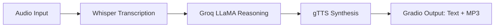

[English](../README.md) · [العربية](README.ar.md) · [Español](README.es.md) · [Français](README.fr.md) · [日本語](README.ja.md) · [한국어](README.ko.md) · [Tiếng Việt](README.vi.md) · [中文 (简体)](README.zh-Hans.md) · [中文（繁體）](README.zh-Hant.md) · [Deutsch](README.de.md) · [Русский](README.ru.md)


[](https://github.com/lachlanchen/lachlanchen/blob/main/figs/banner.png)

# Chatbot vocal avec Whisper, LLaMA et l'API Groq


Ce dépôt propose un chatbot vocal compact et contenu dans un seul fichier. Il capture la parole, la transcrit avec Whisper, envoie le texte à LLaMA hébergé par Groq pour le raisonnement, puis synthétise une réponse parlée via Google Text-to-Speech (gTTS). L’interaction utilisateur finale est gérée par Gradio avec des sorties texte et audio.

> **Objectif :** un pipeline pratique et reproductible que vous pouvez exécuter localement ou sur Colab avec un script principal unique.

## 🧭 Aperçu rapide

| Domaine | Statut |
|---|---|
| Portée linguistique | `README.md` + copies multilingues dans `i18n/` |
| Source de vérité | L'anglais du README racine pilote la synchronisation des traductions |
| Mode recommandé d’exécution | `Local` d’abord, puis `Colab` |

## 🔎 Détails de l’aperçu rapide

| Focus | Statut |
|---|---|
| Point d’entrée | `voice_to_voice_chatbot.py` |
| Interface | UI web basée sur Gradio avec texte + audio |
| Modèle STT | Whisper (`base`) |
| Backend LLM | Groq-hosted `llama3-8b-8192` |
| Moteur TTS | Google Text-to-Speech |
| Documentation | 10+ README traduits dans `i18n/` |

## Vue d’ensemble

L’application implémente un pipeline conversationnel de bout en bout dans `voice_to_voice_chatbot.py` :

1. Recevoir l’audio utilisateur depuis un microphone ou un téléchargement de fichier.
2. Transcrire la parole en texte avec le modèle Whisper (`base`).
3. Générer une réponse avec Groq et `llama3-8b-8192`.
4. Convertir le texte généré en MP3 avec gTTS.
5. Afficher le texte de réponse et les contrôles audio dans Gradio.

### Pipeline conversationnel

| Étape | Composant | Sortie |
|---|---|---|
| 🎙️ Entrée | `gr.Audio(type="filepath")` | Chemin du fichier audio |
| 📝 Transcription | Modèle Whisper `base` | Texte de la transcription |
| 🧠 Raisonnement | Complétion de chat Groq | Texte de la réponse de l’assistant |
| 🔊 Synthèse | `gTTS` | Chemin MP3 de la réponse |
| 🖥️ Livraison | `Gradio Interface` | Texte de réponse + lecture audio |



## ⭐ Fonctionnalités

- **STT + LLM + TTS dans un seul script** : boucle vocale complète dans `voice_to_voice_chatbot.py`.
- **Support micro et fichier** : choisir entre la parole en direct ou un fichier audio déjà enregistré.
- **Configuration légère** : un ensemble réduit de paquets Python.
- **Documentation multilingue** : les README traduits sont maintenus dans `i18n/`.
- **Visibilité de débogage pratique** : les retours d’erreur au niveau fonction sont remontés dans l’UI pour itérer vite.

## 📁 Structure du projet

```text
Voice-to-text-and-voice-chatbot/
    ├── requirements.txt              # Dépendances Python
    ├── voice_to_voice_chatbot.py     # Script principal de l'application
    ├── i18n/                        # Fichiers README traduits
│   ├── README.ar.md
│   ├── README.de.md
│   ├── README.es.md
│   ├── README.fr.md
│   ├── README.ja.md
│   ├── README.ko.md
│   ├── README.ru.md
│   ├── README.vi.md
│   ├── README.zh-Hans.md
│   └── README.zh-Hant.md
└── .auto-readme-work/            # Métadonnées produites pour la génération du README
    ├── 20260228_230442/
    ├── 20260301_064403/
    └── 20260301_065134/
        ├── language-nav-i18n.md
        ├── language-nav-root.md
        ├── pipeline-context.md
        └── translation-plan.txt
```

## 🌍 Localisation et documentation

Ce projet de README conserve une source de vérité en anglais et fournit des variantes traduites dans `i18n/`.

- Utilisez les liens de langue en haut de ce fichier pour basculer entre les README traduits.
- Les traductions existantes couvrent plus de 10 locales et doivent rester synchronisées avec la structure anglaise.
- Préférez d’abord mettre à jour le README anglais, puis aligner les fichiers traduits avec les changements majeurs de structure et de commandes.

## ✅ Prérequis

- Runtime Python 3.7+.
- Une clé API Groq valide.
- Un accès Internet pour le téléchargement du modèle Whisper et les appels API.
- Optionnel : autorisation micro dans le navigateur si vous utilisez l’audio en direct.
- Optionnel : un GPU peut améliorer la latence et la stabilité de la transcription Whisper.

### Exigences en bref

| Exigence | Pourquoi |
|---|---|
| Python `3.7+` | Runtime pour Gradio, Whisper et les dépendances |
| Clé API Groq | Requise pour appeler l’inférence LLM |
| `requirements.txt` | Installe tous les paquets Python nécessaires |
| Accès micro du navigateur | Autorise la saisie vocale via Gradio |

## 🛠️ Installation

1. Cloner le dépôt :

```bash
git clone <repo-url>
cd Voice-to-text-and-voice-chatbot
```

2. Installer les dépendances :

```bash
pip install -r requirements.txt
```

Pour Google Colab :

```python
!pip install -U gradio openai-whisper gtts groq
```

### Notes

- Le dépôt déclare actuellement à la fois `whisper` et `openai-whisper` dans les dépendances.
- En cas de conflits de paquets, privilégiez la variante adaptée à votre environnement puis supprimez les installations redondantes une fois validé.

## 🧯 Checklist de préparation à l’exécution

| Étape | Vérification |
|---|---|
| Clé API | `GROQ_API_KEY` ou fallback local fiable correctement configuré |
| Périphérique audio | Le micro du navigateur est activé pour la saisie directe |
| Chemin d’exécution | Les commandes sont lancées depuis la racine du projet avec les dépendances installées |
| Chemin de sortie | Les dossiers temporaires sont accessibles en écriture pour les réponses MP3 |

## ⚙️ Configuration

### Variable d’environnement (recommandé)

```bash
export GROQ_API_KEY='your_groq_api_key'
```

Dans l’environnement Colab :

```python
import os
os.environ['GROQ_API_KEY'] = 'your_groq_api_key'
```

### Note importante sur le comportement actuel (runtime)

`voice_to_voice_chatbot.py` initialise actuellement Groq ainsi :

```python
client = Groq(
    api_key="your_groq_api_key",
)
```

Si vous ne définissez que `GROQ_API_KEY`, mettez à jour le script pour lire `os.getenv` ou durcir la valeur depuis une variable d’environnement locale de confiance avant d’exécuter :

```python
client = Groq(api_key=os.getenv("GROQ_API_KEY", "your_groq_api_key"))
```

### Hypothèses

- Ce dépôt est prévu pour être exécuté dans un environnement Python local ou Colab.
- Aucune autre entrée serveur ni configuration de déploiement séparée n’est fournie dans cet aperçu.

## ▶️ Utilisation

Démarrez l’application avec :

```bash
python voice_to_voice_chatbot.py
```

Gradio lance une interface locale avec une entrée audio et deux sorties :

- `Response Text`
- `Response Audio`

### Interagir avec le chatbot

- **Microphone** : cliquez sur enregistrement et parlez ; l’audio est transcrit, puis une réponse est générée et lue.
- **Téléversement de fichier** : choisissez un fichier audio pour la transcription et la génération de la réponse.

## 🎬 Exemples

### Parcours type

1. Demander : "What are three tips to learn Python quickly?"
2. Whisper retourne une transcription.
3. Groq génère une réponse.
4. gTTS synthétise la sortie.
5. L’UI affiche le texte et la réponse audio.

### Résultat attendu

- Transcription réussie affichée dans la zone de texte de réponse.
- Fichier audio parlé non vide dans le lecteur Gradio.

## 🧪 Notes de développement

- Fonction principale : `chatbot_pipeline(audio_path)`.
- Whisper est chargé une seule fois à l’import du module avec `whisper.load_model("base")`.
- La sortie audio utilise `NamedTemporaryFile(..., delete=False)` pour la persistance du MP3.
- La voie d’erreur renvoie `(str(e), None)` pour garder l’UI réactive en cas d’échec.
- `iface.launch()` est appelée à l’import du module ; pour un usage bibliothèque, envisagez d’encadrer le lancement avec `if __name__ == "__main__":`.

## 🐞 Dépannage

### Problèmes courants

- `ModuleNotFoundError` pour Whisper :

```bash
pip install -U openai-whisper
```

- Erreurs d’authentification Groq :
  - Vérifiez que la clé API factice est remplacée ou chargée depuis les variables d’environnement.
  - Confirmez que la clé dispose des permissions et du quota suffisants.

- Aucune sortie audio :
  - Vérifiez la connectivité sortante pour Groq et gTTS.
  - Vérifiez que le chemin MP3 temporaire est accessible en écriture dans l’environnement.

### Checklist de diagnostic rapide

| Vérification | Validation |
|---|---|
| Source de la clé API | `Groq(api_key=...)` est une clé valide |
| Dépendance STT | Les importations `import whisper` et `openai-whisper` réussissent |
| Chemin audio | Gradio reçoit un chemin de fichier audio valide |
| Rendu de sortie | L’UI renvoie à la fois le texte de réponse et l’audio |

## 🗺️ Feuille de route

- Remplacer la clé Groq codée en dur par une configuration basée sur les variables d’environnement par défaut.
- Ajouter la sélection de modèle par variable d’environnement (`whisper` size, ID du modèle Groq).
- Ajouter des tests minimaux pour les fonctions utilitaires.
- Ajouter des options de déploiement via CLI et profils (Docker/Hugging Face Spaces).

## ♻️ Stratégie de maintenance et de synchronisation

Pour maintenir une qualité homogène des README multilingues :

1. Mettez à jour d’abord le `README.md` anglais pour les changements de structure ou techniques.
2. Reflétez les titres et les mises à jour de contenu clés dans les traductions `i18n/`.
3. Gardez les blocs `banner` et `support` alignés entre toutes les versions localisées.

## 🤝 Contribution

Les contributions sont les bienvenues. Exemple de flux suggéré :

1. Forker le dépôt.
2. Créer une branche de fonctionnalité.
3. Implémenter vos changements.
4. Ouvrir une pull request claire avec justification et notes de test.

## ❤️ Support

| Donate | PayPal | Stripe |
| --- | --- | --- |
| [](https://chat.lazying.art/donate) | [](https://paypal.me/RongzhouChen) | [](https://buy.stripe.com/aFadR8gIaflgfQV6T4fw400) |

## 📄 License

Ce dépôt indique une intention de licence MIT, mais aucun fichier `LICENSE` n'est présent dans cet instantané. Ajoutez un fichier de licence si une licence est attendue pour la distribution.
