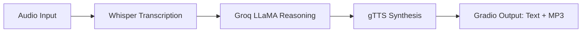

[English](../README.md) · [العربية](README.ar.md) · [Español](README.es.md) · [Français](README.fr.md) · [日本語](README.ja.md) · [한국어](README.ko.md) · [Tiếng Việt](README.vi.md) · [中文 (简体)](README.zh-Hans.md) · [中文（繁體）](README.zh-Hant.md) · [Deutsch](README.de.md) · [Русский](README.ru.md)


[](https://github.com/lachlanchen/lachlanchen/blob/main/figs/banner.png)

# Whisper、LLaMA、Groq APIを使った音声対話チャットボット


このリポジトリは、シンプルで1ファイル構成の音声チャットボットを提供します。音声を取得し、Whisperで文字起こしし、Groq がホストする LLaMA に推論を依頼し、Google Text-to-Speech（gTTS）で音声回答を合成します。エンドユーザーのやり取りは、テキストと音声の両出力を持つ Gradio で扱います。

> **Goal:** 1 つのメインスクリプトで、ローカルまたは Colab で実行できる実用的で再現性の高いパイプライン。

## 🧭 クイックスナップショット

| 項目 | 状態 |
|---|---|
| 言語範囲 | `README.md` と `i18n/` 配下の多言語版 |
| ソースオブトゥルース | 英語版ルート README がローカライズ同期の基準 |
| 推奨実行モード | まず `Local`、次に `Colab` |

## 🔎 クイックスナップショット詳細

| フォーカス | 状態 |
|---|---|
| エントリーポイント | `voice_to_voice_chatbot.py` |
| インターフェース | テキスト＋音声の Gradio ベース Web UI |
| STT モデル | Whisper (`base`) |
| LLM バックエンド | Groq-hosted `llama3-8b-8192` |
| TTS エンジン | Google Text-to-Speech |
| 言語ドキュメント | `i18n/` に 10 か国語以上の翻訳版 README |

## 概要

アプリは `voice_to_voice_chatbot.py` 内でエンドツーエンドの会話パイプラインを実装します。

1. マイク入力またはファイルアップロードからユーザーの音声を受け取る。
2. Whisper（`base`）モデルで音声を文字起こしする。
3. Groq の `llama3-8b-8192` で応答を生成する。
4. gTTS で生成テキストを MP3 に変換する。
5. Gradio で応答テキストと再生コントロールを表示する。

### 会話パイプライン

| ステージ | コンポーネント | 出力 |
|---|---|---|
| 🎙️ 入力 | `gr.Audio(type="filepath")` | 音声ファイルのパス |
| 📝 文字起こし | Whisper `base` モデル | 転写テキスト |
| 🧠 推論 | Groq チャット補完 | アシスタント応答テキスト |
| 🔊 合成 | `gTTS` | MP3 応答のパス |
| 🖥️ 配信 | Gradio `Interface` | 応答テキスト + 音声再生 |



## ⭐ 特徴

- **STT + LLM + TTS を1スクリプトで実装**: `voice_to_voice_chatbot.py` に音声ループ全体を集約。
- **マイクとファイル入力に対応**: リアルタイムの発話入力または録音ファイルのアップロードを選択可能。
- **軽量セットアップ**: 必要最小限の Python パッケージのみ。
- **多言語ドキュメント**: `i18n/` 配下でローカライズ済み README を維持。
- **実用的なデバッグ可視性**: 関数単位のエラー内容を UI に返して高速に反復改善。

## 📁 プロジェクト構成

```text
Voice-to-text-and-voice-chatbot/
    ├── requirements.txt              # Python dependencies
    ├── voice_to_voice_chatbot.py     # Main application script
    ├── i18n/                        # Translated README files
│   ├── README.ar.md
│   ├── README.de.md
│   ├── README.es.md
│   ├── README.fr.md
│   ├── README.ja.md
│   ├── README.ko.md
│   ├── README.ru.md
│   ├── README.vi.md
│   ├── README.zh-Hans.md
│   └── README.zh-Hant.md
└── .auto-readme-work/            # Metadata produced for README generation
    ├── 20260228_230442/
    ├── 20260301_064403/
    └── 20260301_065134/
        ├── language-nav-i18n.md
        ├── language-nav-root.md
        ├── pipeline-context.md
        └── translation-plan.txt
```

## 🌍 ローカリゼーションとドキュメント

この README は英語を唯一の真実の情報源（single source of truth）として扱い、`i18n/` に翻訳版を提供します。

- このファイル先頭付近の言語リンクを使って、翻訳 README を切り替えられます。
- 現時点の翻訳は 10 か国語以上をカバーしており、英語版の構成と同期した状態で保守しています。
- 技術変更や構造変更は最初に英語 README を更新し、その後主要な構成と主要コマンドを各翻訳へ反映します。

## ✅ 前提条件

- Python 3.7+ の実行環境。
- 有効な Groq API キー。
- Whisper モデルのダウンロードと API 呼び出しに必要なインターネット接続。
- 任意: ライブ音声を使う場合はブラウザ側のマイク権限。
- 任意: Whisper のレイテンシと安定性向上には GPU が有利です。

### 要件の概要

| 要件 | 必要な理由 |
|---|---|
| Python `3.7+` | Gradio、Whisper、依存ライブラリの実行環境 |
| Groq API キー | LLM 推論呼び出しに必須 |
| `requirements.txt` | 必要な Python パッケージを一括インストール |
| ブラウザのマイク権限 | Gradio 経由の音声入力を有効化 |

## 🛠️ インストール

1. リポジトリをクローンします。

```bash
git clone <repo-url>
cd Voice-to-text-and-voice-chatbot
```

2. 依存関係をインストールします。

```bash
pip install -r requirements.txt
```

Google Colab では以下を使用します。

```python
!pip install -U gradio openai-whisper gtts groq
```

### メモ

- 現在の `requirements` には `whisper` と `openai-whisper` の両方が記載されています。
- パッケージ競合が発生した場合は、環境に適合する方を優先し、検証後に重複インストールを削除してください。

## 🧯 実行準備チェックリスト

| 項目 | 確認 |
|---|---|
| API キー | `GROQ_API_KEY` または信頼できるローカル代替が正しく設定されている |
| 音声デバイス | ライブ入力用にブラウザのマイクが有効化されている |
| ランタイムパス | 依存関係インストール済みのプロジェクトルートからコマンドを実行 |
| 出力パス | MP3 応答の一時保存先ディレクトリが書き込み可能 |

## ⚙️ 設定

### 環境変数（推奨）

```bash
export GROQ_API_KEY='your_groq_api_key'
```

Colab ランタイムでは:

```python
import os
os.environ['GROQ_API_KEY'] = 'your_groq_api_key'
```

### 重要な実行時メモ（現行動作）

`voice_to_voice_chatbot.py` は現在次のように Groq を初期化しています。

```python
client = Groq(
    api_key="your_groq_api_key",
)
```

`GROQ_API_KEY` のみを設定する場合、実行前に `os.getenv` を使って環境変数から読み込むか、信頼できるローカル値をハードコードするように変更してください。

```python
client = Groq(api_key=os.getenv("GROQ_API_KEY", "your_groq_api_key"))
```

### 前提

- このリポジトリはローカル Python 環境または Colab で実行されることを想定しています。
- このスナップショットには別途サーバー用のエントリポイントやデプロイ設定は含まれていません。

## ▶️ 使い方

以下でアプリを起動します。

```bash
python voice_to_voice_chatbot.py
```

Gradio はローカルで 1 つの音声入力と 2 つの出力を持つインターフェースを起動します。

- `Response Text`
- `Response Audio`

### チャットボットとの対話

- **マイク**: 録音を押して話してください。音声が文字起こしされ、応答生成後に再生されます。
- **ファイルアップロード**: 音声ファイルを選択して文字起こしと応答生成を実行できます。

## 🎬 例

### 実行例

1. 質問: "What are three tips to learn Python quickly?"
2. Whisper が文字起こしを返します。
3. Groq が回答を生成します。
4. gTTS が音声を合成します。
5. UI にテキストと音声回答が表示されます。

### 期待される出力

- 成功した文字起こしが応答テキストボックスに表示される。
- Gradio のオーディオプレイヤーで非空の音声ファイルが再生可能になる。

## 🧪 開発ノート

- コア関数: `chatbot_pipeline(audio_path)`。
- Whisper は `whisper.load_model("base")` でモジュール読み込み時に1回だけロードされます。
- 音声出力は `NamedTemporaryFile(..., delete=False)` で mp3 を永続化します。
- エラー時は `(str(e), None)` を返し、UI の応答性を保ちます。
- `iface.launch()` はモジュール読み込み時に呼び出されます。ライブラリ用途で使う場合は `if __name__ == "__main__":` で起動コードをガードすることを検討してください。

## 🐞 トラブルシューティング

### よくある問題

- Whisper の `ModuleNotFoundError`:

```bash
pip install -U openai-whisper
```

- Groq の認証失敗:
  - プレースホルダー API キーを実キーに置き換えるか、環境変数から読み込む。
  - キーの権限とクォータを確認する。

- 出力音声が無い:
  - Groq と gTTS の外部接続を確認する。
  - 一時 MP3 の保存先が書き込み可能か確認する。

### 簡易診断チェックリスト

| チェック項目 | 検証 |
|---|---|
| API キー元 | `Groq(api_key=...)` が有効なキーか |
| STT 依存 | `import whisper` と `openai-whisper` の import が成功している |
| 音声パス | Gradio に有効な音声ファイルパスが渡される |
| 出力描画 | UI がテキストと音声の両方を返す |

## 🗺️ ロードマップ

- Groq キーをハードコードせず、デフォルトで環境変数ベース設定に置き換える。
- 環境変数ベースでモデル選択（Whisper サイズ、Groq モデル ID）を追加する。
- ヘルパー関数向けの最小テストを追加する。
- CLI とデプロイ用プリセット（Docker / Hugging Face Spaces）を追加する。

## ♻️ メンテナンスと同期方針

多言語 README の品質を一貫させるため:

1. 構造や技術変更はまず英語の `README.md` を更新します。
2. 見出しと主要内容を `i18n/` 翻訳へ反映します。
3. バナーとサポートブロックを各翻訳版で統一します。

## 🤝 貢献

貢献を歓迎します。推奨フローは次のとおりです。

1. リポジトリをフォークする。
2. フィーチャーブランチを作成する。
3. 変更を実装する。
4. 根拠とテストノートを添えて明確なプルリクエストを開く。

## 📄 ライセンス

このリポジトリは MIT を参照している意図がありますが、このスナップショットには `LICENSE` ファイルがありません。配布を想定する場合はライセンスファイルを追加してください。


## ❤️ Support

| Donate | PayPal | Stripe |
| --- | --- | --- |
| [](https://chat.lazying.art/donate) | [](https://paypal.me/RongzhouChen) | [](https://buy.stripe.com/aFadR8gIaflgfQV6T4fw400) |
