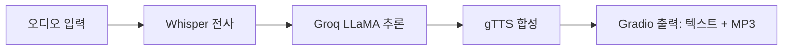

[English](../README.md) · [العربية](README.ar.md) · [Español](README.es.md) · [Français](README.fr.md) · [日本語](README.ja.md) · [한국어](README.ko.md) · [Tiếng Việt](README.vi.md) · [中文 (简体)](README.zh-Hans.md) · [中文（繁體）](README.zh-Hant.md) · [Deutsch](README.de.md) · [Русский](README.ru.md)


[](https://github.com/lachlanchen/lachlanchen/blob/main/figs/banner.png)

# Whisper, LLaMA 및 Groq API를 사용한 음성-음성 챗봇


이 저장소는 단일 파일로 동작하는 컴팩트한 음성 챗봇을 제공합니다. 음성을 수집해 Whisper로 전사하고, 그 결과 텍스트를 Groq가 제공하는 LLaMA에 전달해 추론한 뒤, Google Text-to-Speech(gTTS)로 음성 응답을 생성합니다. 사용자 인터랙션은 텍스트와 오디오 출력이 모두 포함된 Gradio UI가 처리합니다.

> **목표:** 로컬 또는 Colab에서 단일 메인 스크립트만으로 실행할 수 있는 실용적이고 재현 가능한 파이프라인.

## 🧭 빠른 개요

| 항목 | 상태 |
|---|---|
| 언어 범위 | `README.md`와 `i18n/`의 다국어 사본 |
| 기준 원문 | 영문 루트 README가 로컬라이제이션 동기화 기준 |
| 권장 실행 모드 | 먼저 `Local`, 다음 `Colab` |

## 🔎 빠른 개요 상세

| 항목 | 상태 |
|---|---|
| 진입점 | `voice_to_voice_chatbot.py` |
| 인터페이스 | 텍스트 + 오디오를 제공하는 Gradio 기반 웹 UI |
| STT 모델 | Whisper (`base`) |
| LLM 백엔드 | Groq 호스팅 `llama3-8b-8192` |
| TTS 엔진 | Google Text-to-Speech |
| 언어별 문서 | `i18n/`의 10개 이상 번역 README |

## 개요

이 앱은 `voice_to_voice_chatbot.py`에서 종단 간 대화 파이프라인을 구현합니다.

1. 마이크 입력 또는 파일 업로드로 사용자 오디오를 수신합니다.
2. Whisper (`base`) 모델로 음성을 텍스트로 전사합니다.
3. Groq와 `llama3-8b-8192`로 응답을 생성합니다.
4. 생성된 텍스트를 gTTS로 MP3로 변환합니다.
5. 텍스트 응답과 재생 컨트롤을 Gradio로 표시합니다.

### 대화 파이프라인

| 단계 | 구성 요소 | 출력 |
|---|---|---|
| 🎙️ 입력 | `gr.Audio(type="filepath")` | 오디오 파일 경로 |
| 📝 전사 | Whisper `base` 모델 | 전사 텍스트 |
| 🧠 추론 | Groq 챗 완료 API | 도우미 응답 텍스트 |
| 🔊 합성 | `gTTS` | MP3 응답 경로 |
| 🖥️ 전달 | Gradio `Interface` | 응답 텍스트 + 오디오 재생 |



## ⭐ 기능

- **STT + LLM + TTS를 하나의 스크립트로 통합**: `voice_to_voice_chatbot.py`에서 전체 음성 루프를 구현합니다.
- **마이크 및 파일 지원**: 실시간 음성을 말하거나 녹음 파일을 업로드할 수 있습니다.
- **가벼운 환경 구성**: 소수의 Python 패키지만 필요합니다.
- **다국어 문서화**: `i18n/`에서 로컬라이즈된 README를 관리합니다.
- **실용적인 디버깅 가시성**: 함수 수준 오류 반환이 UI에 바로 노출되어 빠른 반복 수정이 가능합니다.

## 📁 프로젝트 구조

```text
Voice-to-text-and-voice-chatbot/
    ├── requirements.txt              # Python dependencies
    ├── voice_to_voice_chatbot.py     # Main application script
    ├── i18n/                        # Translated README files
│   ├── README.ar.md
│   ├── README.de.md
│   ├── README.es.md
│   ├── README.fr.md
│   ├── README.ja.md
│   ├── README.ko.md
│   ├── README.ru.md
│   ├── README.vi.md
│   ├── README.zh-Hans.md
│   └── README.zh-Hant.md
└── .auto-readme-work/            # Metadata produced for README generation
    ├── 20260228_230442/
    ├── 20260301_064403/
    └── 20260301_065134/
        ├── language-nav-i18n.md
        ├── language-nav-root.md
        ├── pipeline-context.md
        └── translation-plan.txt
```

## 🌍 로컬라이제이션 및 문서

이 README 프로젝트는 영문 원문을 단일 기준으로 두고, `i18n/`에 번역 버전을 제공합니다.

- 이 파일 맨 위의 언어 링크로 번역본 사이를 전환할 수 있습니다.
- 기존 번역은 10개 이상의 로케일을 다루며 영문 구조와 동기화 상태를 유지해야 합니다.
- 먼저 영문 README를 먼저 갱신한 뒤, 구조 변경과 주요 명령 변경을 반영해 번역본을 정렬하세요.

## ✅ 선행 조건

- Python 3.7+ 런타임.
- 유효한 Groq API 키.
- Whisper 모델 다운로드 및 API 호출을 위한 인터넷 연결.
- 선택: 실시간 오디오를 사용한다면 브라우저의 마이크 권한.
- 선택: GPU가 있으면 Whisper 전사 지연시간과 일관성을 개선할 수 있습니다.

### 요구사항 한눈에 보기

| 요구사항 | 필요한 이유 |
|---|---|
| Python `3.7+` | Gradio, Whisper, 기타 의존성 실행을 위한 런타임 |
| Groq API 키 | LLM 추론 호출을 위한 인증 값 |
| `requirements.txt` | 필요한 Python 패키지를 모두 설치 |
| 브라우저 마이크 접근 | Gradio를 통해 음성 입력을 사용하기 위한 권한 |

## 🛠️ 설치

1. 저장소를 클론합니다.

```bash
git clone <repo-url>
cd Voice-to-text-and-voice-chatbot
```

2. 의존성을 설치합니다.

```bash
pip install -r requirements.txt
```

Google Colab에서는 아래를 사용하세요.

```python
!pip install -U gradio openai-whisper gtts groq
```

### 참고 사항

- 현재 요구사항에는 `whisper`와 `openai-whisper`가 모두 선언되어 있습니다.
- 패키지 충돌이 발생하면 환경에 맞는 버전을 우선 사용하고, 검증 후 중복 설치 항목을 제거하세요.

## 🧯 실행 준비 체크리스트

| 단계 | 확인 |
|---|---|
| API 키 | `GROQ_API_KEY` 또는 신뢰 가능한 로컬 대체 경로가 올바르게 설정됨 |
| 오디오 장치 | 라이브 입력을 위해 브라우저 마이크가 활성화됨 |
| 실행 경로 | 프로젝트 루트에서 의존성 설치 후 명령 실행 |
| 출력 경로 | 임시 디렉터리에 MP3 응답을 쓰기 위한 권한이 있음 |

## ⚙️ 설정

### 환경 변수 (권장)

```bash
export GROQ_API_KEY='your_groq_api_key'
```

Colab 런타임에서는 아래처럼 설정합니다.

```python
import os
os.environ['GROQ_API_KEY'] = 'your_groq_api_key'
```

### 중요 런타임 참고사항 (현재 동작)

`voice_to_voice_chatbot.py`는 현재 다음과 같이 Groq를 초기화합니다.

```python
client = Groq(
    api_key="your_groq_api_key",
)
```

`GROQ_API_KEY`만 설정한 경우, 실행 전 스크립트를 수정해 `os.getenv`를 사용하거나 신뢰 가능한 로컬 환경 변수에서 값을 읽어오도록 하세요.

```python
client = Groq(api_key=os.getenv("GROQ_API_KEY", "your_groq_api_key"))
```

### 가정

- 이 저장소는 로컬 Python 환경이나 Colab에서 실행하는 것을 가정합니다.
- 현재 스냅샷에는 별도의 서버 엔트리포인트나 배포 설정이 없습니다.

## ▶️ 사용법

다음으로 애플리케이션을 시작합니다.

```bash
python voice_to_voice_chatbot.py
```

Gradio는 텍스트 입력과 오디오 출력 두 개의 출력이 있는 로컬 인터페이스를 실행합니다.

- `Response Text`
- `Response Audio`

### 챗봇과의 상호작용

- **마이크**: 녹음 버튼을 누르고 말하세요. 오디오가 전사되어 답변 후 재생됩니다.
- **파일 업로드**: 음성 파일을 선택해 전사 및 응답 생성 흐름을 실행합니다.

## 🎬 예시

### 예시 흐름

1. 질문: "Python을 빠르게 배우는 3가지 팁은 무엇인가요?"
2. Whisper가 전사 텍스트를 반환합니다.
3. Groq가 답변을 생성합니다.
4. gTTS가 출력을 합성합니다.
5. UI가 텍스트와 오디오 응답을 표시합니다.

### 예상 출력

- 성공적인 전사는 응답 텍스트 박스에 표시됩니다.
- Gradio 오디오 플레이어에서 비어 있지 않은 음성 응답 파일이 나타납니다.

## 🧪 개발 노트

- 핵심 함수: `chatbot_pipeline(audio_path)`.
- `whisper.load_model("base")`로 모듈 임포트 시 Whisper를 한 번 로드합니다.
- 오디오 출력은 `NamedTemporaryFile(..., delete=False)`를 사용해 mp3의 영속성을 유지합니다.
- 오류 경로에서는 `(str(e), None)`을 반환해 실패 시에도 UI 반응성을 유지합니다.
- `iface.launch()`는 모듈 임포트 시 호출되므로, 라이브러리 스타일로 사용하려면 `if __name__ == "__main__":`로 실행 코드를 감싸는 것을 고려하세요.

## 🐞 문제 해결

### 일반적인 이슈

- Whisper의 `ModuleNotFoundError`:

```bash
pip install -U openai-whisper
```

- Groq 인증 실패:
  - 플레이스홀더 API 키가 교체되었는지 또는 환경 변수에서 로드되는지 확인하세요.
  - 키에 충분한 권한과 할당량이 있는지 확인하세요.

- 오디오 출력 없음:
  - Groq와 gTTS의 아웃바운드 연결을 확인하세요.
  - 환경에서 임시 MP3 경로 쓰기 권한이 있는지 확인하세요.

### 빠른 진단 체크리스트

| 확인 항목 | 검증 |
|---|---|
| API 키 출처 | `Groq(api_key=...)`가 유효한 키 |
| STT 의존성 | `import whisper`와 `openai-whisper` import 성공 |
| 오디오 경로 | Gradio에 유효한 오디오 파일 경로가 전달됨 |
| 출력 렌더링 | UI가 텍스트와 오디오를 모두 반환 |

## 🗺️ 로드맵

- 기본 동작에서 하드코딩된 Groq 키를 환경 변수 기반 설정으로 교체.
- 환경 기반 모델 선택 기능 추가 (`whisper` 크기, Groq 모델 ID).
- 핵심 헬퍼 함수에 대한 최소 테스트 추가.
- CLI 및 배포 프리셋 추가(Docker/Hugging Face Spaces).

## ♻️ 유지보수 및 동기화 전략

다국어 README 품질을 일관되게 유지하려면:

1. 구조적/기술 변경이 있으면 영문 `README.md`를 먼저 갱신합니다.
2. 헤더와 핵심 내용을 `i18n/` 번역본에 반영합니다.
3. 배너와 지원 블록은 모든 로컬라이즈본에서 동일하게 맞춰 둡니다.

## 🤝 기여

기여를 환영합니다. 다음과 같은 흐름을 권장합니다.

1. 저장소를 포크합니다.
2. 기능 브랜치를 생성합니다.
3. 변경 사항을 구현합니다.
4. 근거와 검증 사항을 포함한 명확한 풀 요청을 엽니다.

## 📄 라이선스

이 저장소는 MIT 라이선스 의도를 참조하지만, 현재 스냅샷에는 `LICENSE` 파일이 없습니다. 배포가 필요할 경우 라이선스 파일을 추가하세요.


## ❤️ Support

| Donate | PayPal | Stripe |
| --- | --- | --- |
| [](https://chat.lazying.art/donate) | [](https://paypal.me/RongzhouChen) | [](https://buy.stripe.com/aFadR8gIaflgfQV6T4fw400) |
