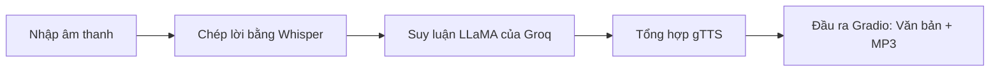

[English](../README.md) · [العربية](README.ar.md) · [Español](README.es.md) · [Français](README.fr.md) · [日本語](README.ja.md) · [한국어](README.ko.md) · [Tiếng Việt](README.vi.md) · [中文 (简体)](README.zh-Hans.md) · [中文（繁體）](README.zh-Hant.md) · [Deutsch](README.de.md) · [Русский](README.ru.md)


[](https://github.com/lachlanchen/lachlanchen/blob/main/figs/banner.png)

# Ứng dụng Voice-to-Voice Chatbot bằng Whisper, LLaMA, và Groq API


Kho lưu trữ này cung cấp một chatbot thoại gọn nhẹ dạng một file duy nhất. Ứng dụng ghi nhận giọng nói, chuyển ngữ thành văn bản bằng Whisper, gửi văn bản tới LLaMA do Groq lưu trữ để suy luận, và tổng hợp câu trả lời bằng Google Text-to-Speech (gTTS). Tương tác đầu-cuối do Gradio xử lý với cả đầu ra văn bản và âm thanh.

> **Mục tiêu:** một quy trình thực tế, tái tạo được, có thể chạy cục bộ hoặc trên Colab bằng đúng một script chính.

## 🧭 Bức tranh nhanh

| Khu vực | Trạng thái |
|---|---|
| Phạm vi ngôn ngữ | `README.md` cùng các bản dịch trong `i18n/` |
| Nguồn tham chiếu | README tiếng Anh ở gốc điều phối đồng bộ hóa bản địa hóa |
| Chế độ chạy khuyên dùng | `Local` trước, `Colab` sau |

## 🔎 Chi tiết nhanh

| Tập trung | Trạng thái |
|---|---|
| Điểm vào | `voice_to_voice_chatbot.py` |
| Giao diện | Giao diện web dựa trên Gradio với văn bản + âm thanh |
| Mô hình STT | Whisper (`base`) |
| Backend LLM | Groq-hosted `llama3-8b-8192` |
| Engine TTS | Google Text-to-Speech |
| Tài liệu ngôn ngữ | 10+ file README đã dịch trong `i18n/` |

## Tổng quan

Ứng dụng triển khai pipeline hội thoại đầu-cuối trong `voice_to_voice_chatbot.py`:

1. Nhận âm thanh người dùng từ micro hoặc file tải lên.
2. Chuyển lời nói thành chữ bằng mô hình Whisper (`base`).
3. Tạo phản hồi bằng Groq và `llama3-8b-8192`.
4. Chuyển văn bản tạo ra thành MP3 bằng gTTS.
5. Hiển thị văn bản phản hồi và điều khiển phát lại trong Gradio.

### Quy trình hội thoại

| Giai đoạn | Thành phần | Kết quả |
|---|---|---|
| 🎙️ Đầu vào | `gr.Audio(type="filepath")` | Đường dẫn file âm thanh |
| 📝 Chép lời | Mô hình Whisper `base` | Văn bản chép |
| 🧠 Suy luận | Hoàn thành chat của Groq | Văn bản phản hồi của trợ lý |
| 🔊 Tổng hợp | `gTTS` | Đường dẫn MP3 phản hồi |
| 🖥️ Trình bày | `Gradio Interface` | Văn bản phản hồi + phát lại âm thanh |



## ⭐ Tính năng

- **STT + LLM + TTS trong một script**: vòng lặp giọng nói đầy đủ trong `voice_to_voice_chatbot.py`.
- **Hỗ trợ micro và file**: chọn giọng nói trực tiếp hoặc tải lên file đã ghi.
- **Cài đặt nhẹ**: chỉ cần một nhóm nhỏ package Python.
- **Tài liệu đa ngôn ngữ**: các README bản địa hóa được duy trì trong `i18n/`.
- **Hiển thị debugging thực dụng**: các lỗi cấp hàm sẽ xuất hiện trong UI để lặp nhanh.

## 📁 Cấu trúc dự án

```text
Voice-to-text-and-voice-chatbot/
    ├── requirements.txt              # Python dependencies
    ├── voice_to_voice_chatbot.py     # Main application script
    ├── i18n/                        # Translated README files
│   ├── README.ar.md
│   ├── README.de.md
│   ├── README.es.md
│   ├── README.fr.md
│   ├── README.ja.md
│   ├── README.ko.md
│   ├── README.ru.md
│   ├── README.vi.md
│   ├── README.zh-Hans.md
│   └── README.zh-Hant.md
└── .auto-readme-work/            # Metadata produced for README generation
    ├── 20260228_230442/
    ├── 20260301_064403/
    └── 20260301_065134/
        ├── language-nav-i18n.md
        ├── language-nav-root.md
        ├── pipeline-context.md
        └── translation-plan.txt
```

## 🌍 Đa ngôn ngữ và tài liệu

Dự án README này giữ một nguồn gốc tiếng Anh làm chuẩn và cung cấp các biến thể dịch trong `i18n/`.

- Dùng các liên kết ngôn ngữ gần đầu file này để chuyển giữa các bản dịch README.
- Các bản dịch hiện có bao phủ trên 10 ngôn ngữ và nên được đồng bộ với cấu trúc tiếng Anh.
- Ưu tiên cập nhật README tiếng Anh trước, sau đó đồng bộ các bản dịch với thay đổi chính của cấu trúc và lệnh.

## ✅ Yêu cầu tiên quyết

- Runtime Python 3.7+.
- Một khóa API Groq hợp lệ.
- Truy cập Internet để tải mô hình Whisper và gọi API.
- Tùy chọn: quyền truy cập microphone trong trình duyệt nếu bạn dùng âm thanh trực tiếp.
- Tùy chọn: GPU có thể cải thiện độ trễ và độ ổn định của quá trình chép lời Whisper.

### Yêu cầu nhanh

| Yêu cầu | Lý do cần |
|---|---|
| Python `3.7+` | Runtime cho Gradio, Whisper và các dependency |
| Khóa API Groq | Cần thiết để gọi suy luận LLM |
| `requirements.txt` | Cài đặt tất cả package Python cần thiết |
| Truy cập micro của trình duyệt | Cho phép nhập thoại qua Gradio |

## 🛠️ Cài đặt

1. Clone repository:

```bash

git clone <repo-url>
cd Voice-to-text-and-voice-chatbot
```

2. Cài đặt dependencies:

```bash
pip install -r requirements.txt
```

For Google Colab use:

```python
!pip install -U gradio openai-whisper gtts groq
```

### Ghi chú

- Repo hiện tại khai báo cả `whisper` và `openai-whisper` trong file requirements.
- Nếu bạn gặp xung đột package, hãy ưu tiên phiên bản khớp môi trường của bạn và bỏ các cài đặt thừa sau khi đã xác thực.

## 🧯 Danh sách kiểm tra sẵn sàng chạy

| Bước | Kiểm tra |
|---|---|
| API key | `GROQ_API_KEY` hoặc cơ chế dự phòng local tin cậy đã được cấu hình đúng |
| Thiết bị âm thanh | Micro của trình duyệt bật cho input trực tiếp |
| Đường chạy runtime | Các lệnh chạy từ thư mục gốc của dự án với dependencies đã cài |
| Đường xuất | Thư mục tạm ghi được file MP3 phản hồi |

## ⚙️ Cấu hình

### Biến môi trường (khuyên dùng)

```bash
export GROQ_API_KEY='your_groq_api_key'
```

Trong runtime Colab:

```python
import os
os.environ['GROQ_API_KEY'] = 'your_groq_api_key'
```

### Lưu ý runtime quan trọng (hành vi hiện tại)

`voice_to_voice_chatbot.py` hiện tại khởi tạo Groq như sau:

```python
client = Groq(
    api_key="your_groq_api_key",
)
```

Nếu bạn chỉ thiết lập `GROQ_API_KEY`, hãy chỉnh script để đọc từ `os.getenv` hoặc hardcode từ biến môi trường local đáng tin cậy trước khi chạy:

```python
client = Groq(api_key=os.getenv("GROQ_API_KEY", "your_groq_api_key"))
```

### Giả định

- Repo dự kiến chạy trong môi trường Python local hoặc Colab.
- Không có entrypoint server riêng hay cấu hình deploy trong snapshot hiện tại.

## ▶️ Sử dụng

Khởi chạy ứng dụng với:

```bash
python voice_to_voice_chatbot.py
```

Gradio sẽ mở một giao diện local với một đầu vào âm thanh và hai đầu ra:

- `Response Text`
- `Response Audio`

### Tương tác với Chatbot

- **Micro**: nhấn ghi và nói; âm thanh sẽ được chép thành văn bản, trả lời, sau đó phát lại.
- **Tải file**: chọn file âm thanh để chép lời và tạo phản hồi.

## 🎬 Ví dụ

### Luồng ví dụ

1. Hỏi: "Ba mẹo nào học Python nhanh nhất?"
2. Whisper trả về bản chép lời.
3. Groq tạo câu trả lời.
4. gTTS tổng hợp đầu ra.
5. UI hiển thị văn bản và phản hồi âm thanh.

### Kết quả dự kiến

- Chép lời thành công hiển thị trong ô văn bản phản hồi.
- File âm thanh nói không rỗng trong trình phát âm thanh Gradio.

## 🧪 Ghi chú phát triển

- Hàm cốt lõi: `chatbot_pipeline(audio_path)`.
- Whisper được tải một lần khi import module với `whisper.load_model("base")`.
- Đầu ra âm thanh dùng `NamedTemporaryFile(..., delete=False)` để giữ file mp3.
- Đường lỗi trả về `(str(e), None)` để giữ cho UI phản hồi ngay khi gặp lỗi.
- `iface.launch()` được gọi khi import module; với cách dùng theo phong cách thư viện, cân nhắc bọc phần launch bằng `if __name__ == "__main__":`.

## 🐞 Khắc phục sự cố

### Các lỗi thường gặp

- `ModuleNotFoundError` cho Whisper:

```bash
pip install -U openai-whisper
```

- Lỗi xác thực Groq:
  - Đảm bảo khóa API placeholder đã được thay bằng giá trị thật hoặc được nạp từ biến môi trường.
  - Xác nhận khóa có quyền truy cập và quota đủ.

- Không có âm thanh đầu ra:
  - Kiểm tra kết nối outbound cho Groq và gTTS.
  - Đảm bảo đường dẫn MP3 tạm có thể ghi được trong môi trường.

### Danh sách chẩn đoán nhanh

| Kiểm tra | Xác thực |
|---|---|
| Nguồn API key | `Groq(api_key=...)` là khóa hợp lệ |
| Phụ thuộc STT | `import whisper` và `openai-whisper` import thành công |
| Đường âm thanh | Gradio nhận được đường dẫn âm thanh hợp lệ |
| Render đầu ra | UI trả về cả text phản hồi và audio |

## 🗺️ Lộ trình

- Thay thế khóa Groq hardcoded bằng cấu hình hoàn toàn dựa trên biến môi trường theo mặc định.
- Thêm chọn model theo môi trường (`whisper` size, Groq model ID).
- Thêm test tối thiểu cho các hàm tiện ích.
- Thêm giao diện CLI và preset deploy (Docker/Hugging Face Spaces).

## ♻️ Chiến lược bảo trì và đồng bộ

Để duy trì chất lượng nhất quán cho README đa ngôn ngữ:

1. Cập nhật `README.md` tiếng Anh trước cho các thay đổi cấu trúc hoặc kỹ thuật.
2. Đưa các tiêu đề và nội dung chính vào các bản dịch trong `i18n/`.
3. Giữ banner và khối hỗ trợ đồng bộ giữa các phiên bản ngôn ngữ.

## 🤝 Đóng góp

Đóng góp luôn được chào đón. Quy trình gợi ý:

1. Fork repository.
2. Tạo một nhánh tính năng.
3. Thực hiện thay đổi.
4. Mở pull request rõ ràng với lý do và ghi chú kiểm thử.

## 📄 Giấy phép

Repository này tham chiếu ý định cấp phép MIT, nhưng trong snapshot hiện tại chưa có file `LICENSE`. Hãy thêm file giấy phép nếu mong muốn cấp phép khi phân phối.


## ❤️ Support

| Donate | PayPal | Stripe |
| --- | --- | --- |
| [](https://chat.lazying.art/donate) | [](https://paypal.me/RongzhouChen) | [](https://buy.stripe.com/aFadR8gIaflgfQV6T4fw400) |
